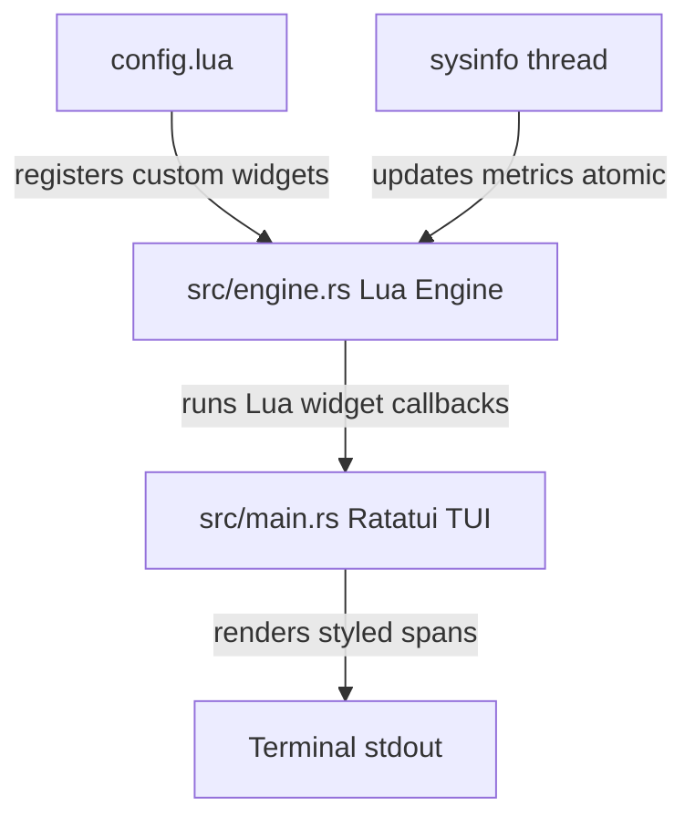

# Terminal System Monitor (Rust & Lua)

A highly extensible, performance-oriented terminal system monitor powered by Rust and scripted dynamically in Lua. 

This project uses **Rust** for the heavy lifting (polling system APIs, running background worker threads, and rendering the terminal layout) and embeds **Lua** as a runtime scripting engine so users can define, style, and structure custom metrics widgets on the fly.

---

## ⚡ Features (POC)
* **Lua Scripted UI Widgets**: Registered dynamically in Lua with runtime callback renderers.
* **Live System Metrics**: Queries CPU usage using the Rust `sysinfo` library.
* **Safe Terminal UI Layouts**: Built using `ratatui` and `crossterm`.
* **Robust Error Handling**: Any Lua scripting or runtime errors are safely caught and displayed inside the widget boundary rather than crashing the entire process.

---

## 📁 Project Architecture



---

## 🛠️ Prerequisites
* **Rust & Cargo** (installed on your system).
* No Lua developer packages are needed: the project is preconfigured to build a **vendored version of Lua 5.4** automatically during compile time.

---

## 🚀 Installation & Execution

### 1. One-Click Global Installation
You can download, compile-free install, and configure `term-sys-monitor` in your `PATH` using a single command:

* **Linux / macOS (Bash)**:
  ```bash
  curl -fsSL https://raw.githubusercontent.com/indoctrinatedrecluse/term-sys-monitor/main/install.sh | bash
  ```
* **Windows (PowerShell)**:
  ```powershell
  iwr -useb https://raw.githubusercontent.com/indoctrinatedrecluse/term-sys-monitor/main/install.ps1 | iex
  ```

Once installed, restart your shell and execute:
```bash
term-sys-monitor
```
> [!NOTE]
> On the very first launch, the program will automatically create a configuration folder and copy a default `config.lua` script there:
> * **Windows**: `%APPDATA%\sysmon\config.lua`
> * **Linux/macOS**: `$HOME/.config/sysmon/config.lua`

---

### 2. Cargo Installation (Compile from Source)
If you have the Rust toolchain installed, run:
```bash
cargo install --git https://github.com/indoctrinatedrecluse/term-sys-monitor.git
```

---

### 3. Local Development Build
To compile and run the project locally in the workspace:
* **Cargo**: `cargo run`
* **Windows (PowerShell script)**: `./run.ps1`
* **Linux / macOS (Bash script)**: `chmod +x run.sh && ./run.sh`


---

## ⚙️ Customization (`config.lua`)

The monitor is fully scriptable. Open `config.lua` in the root of the project to customize the display metrics.

Example widget definition:
```lua
local sysmon = require("sysmon")

sysmon.register_widget("cpu_percent", {
    render = function()
        local usage = sysmon.get_cpu_usage()
        local color = "green"
        if usage > 80 then
            color = "red"
        elseif usage > 50 then
            color = "yellow"
        end
        return string.format("CPU Usage: %.1f%%", usage), color
    end
})
```
* **`sysmon.get_cpu_usage()`**: Exposes the live global CPU load from Rust (0.0 to 100.0).
* **`sysmon.get_total_memory()`**: Returns total system RAM in bytes.
* **`sysmon.get_used_memory()`**: Returns used system RAM in bytes.
* **`sysmon.get_memory_percent()`**: Returns RAM utilization percentage (0.0 to 100.0).
* **`sysmon.get_gpu_usage()`**: Returns GPU core utilization percentage (0.0 to 100.0), or `-1.0` if NVML is unavailable.
* **`sysmon.get_gpu_memory_used()`**: Returns GPU VRAM used in bytes, or `-1` if unavailable.
* **`sysmon.get_gpu_memory_total()`**: Returns total GPU VRAM in bytes, or `-1` if unavailable.
* **`sysmon.get_gpu_name()`**: Returns the GPU model name as a string, or `"N/A"`.
* **`sysmon.get_disks()`**: Returns a table array of mounted disk partitions. Each item contains:
  * `name`: Volume label string.
  * `mount_point`: Mount point directory string (e.g., `C:\` or `/`).
  * `total_space`: Capacity in bytes.
  * `available_space`: Free capacity in bytes.
  * `is_removable`: Boolean indicating external/USB media.
* **`sysmon.get_uptime()`**: Returns system uptime in seconds.
* **`sysmon.get_cpu_brand()`**: Returns the CPU model brand string.
* **`sysmon.get_cpu_frequency()`**: Returns the CPU core frequency in MHz.
* **`sysmon.get_hostname()`**: Returns the system hostname.
* **`sysmon.get_os_name()`**: Returns the operating system name (e.g., `"Windows"`).
* **`sysmon.get_kernel_version()`**: Returns the OS kernel version.
* **`sysmon.create_bar(percent, width)`**: Generates a standard Unicode progress bar block string (defaults to a width of 20).
* **`sysmon.create_sparkline(values_table)`**: Generates a horizontal Unicode sparkline trend chart string based on a Lua array of floats (0.0 to 100.0).
* **`sysmon.get_processes(sort_by, limit)`**: Returns a table array of top running processes. `sort_by` can be `"cpu"` or `"memory"`. `limit` defaults to 5. Each process item contains:
  * `pid`: Integer process ID.
  * `name`: Process name string.
  * `cpu_usage`: Process CPU utilization percentage (0.0 to 100.0).
  * `memory`: Memory space consumed in bytes.

* **Return values**: The widget `render` function can return:
  1. **Single string & optional color** (e.g., `return "Text", "green"`).
  2. **Table of spans** for rich multi-color lines (e.g., `return { { "[██", "green" }, { "░░]", "gray" } }`).

* **Interactive Controls**:
  * **`q`**: Quits the application and restores the terminal console.
  * **`r`**: Hot-reloads `config.lua` instantly at runtime, letting you design widgets live.
