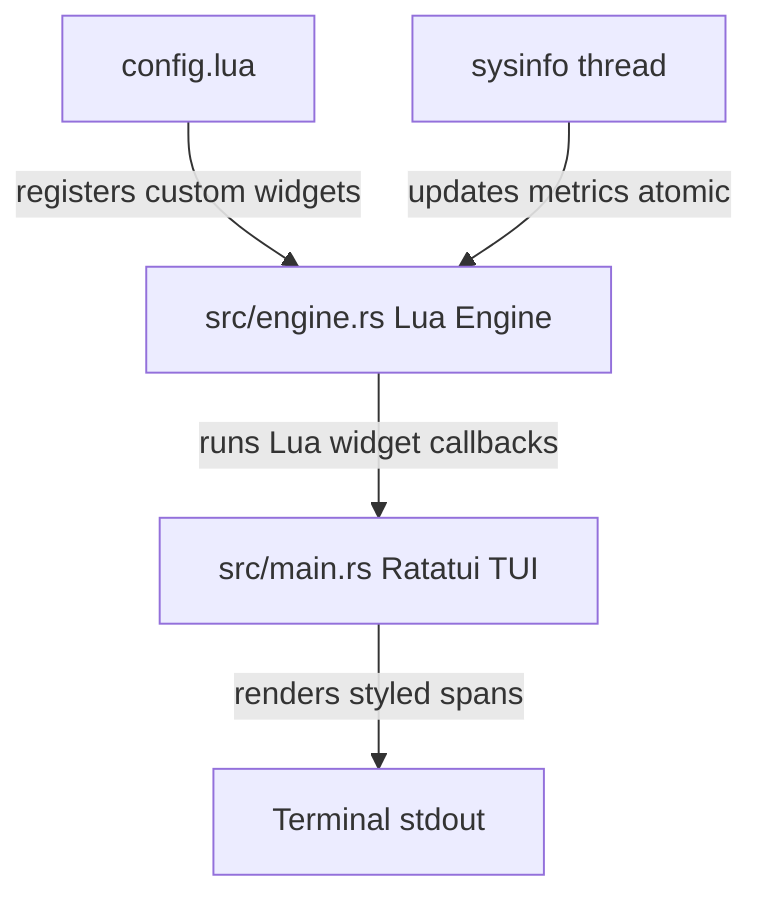

# Terminal System Monitor (Rust & Lua)

A highly extensible, performance-oriented terminal system monitor powered by Rust and scripted dynamically in Lua. 

This project uses **Rust** for the heavy lifting (polling system APIs, running background worker threads, and rendering the terminal layout) and embeds **Lua** as a runtime scripting engine so users can define, style, and structure custom metrics widgets on the fly.

---

## ⚡ Features (POC)
* **Lua Scripted UI Widgets**: Registered dynamically in Lua with runtime callback renderers.
* **Live System Metrics**: Queries CPU usage using the Rust `sysinfo` library.
* **Safe Terminal UI Layouts**: Built using `ratatui` and `crossterm`.
* **Robust Error Handling**: Any Lua scripting or runtime errors are safely caught and displayed inside the widget boundary rather than crashing the entire process.

---

## 📁 Project Architecture



---

## 🛠️ Prerequisites
* **Rust & Cargo** (installed on your system).
* No Lua developer packages are needed: the project is preconfigured to build a **vendored version of Lua 5.4** automatically during compile time.

---

## 🚀 Build and Run

### Standard Cargo Execution
To run the project in development mode:
```bash
cargo run
```

### One-Click Launch Scripts
To clean up previous builds, check/update dependencies, and start the system monitor with one click:

* **Windows (PowerShell)**:
  ```powershell
  ./run.ps1
  ```
* **Linux / macOS**:
  ```bash
  chmod +x run.sh
  ./run.sh
  ```

---

## ⚙️ Customization (`config.lua`)

The monitor is fully scriptable. Open `config.lua` in the root of the project to customize the display metrics.

Example widget definition:
```lua
local sysmon = require("sysmon")

sysmon.register_widget("cpu_percent", {
    render = function()
        local usage = sysmon.get_cpu_usage()
        local color = "green"
        if usage > 80 then
            color = "red"
        elseif usage > 50 then
            color = "yellow"
        end
        return string.format("CPU Usage: %.1f%%", usage), color
    end
})
```
* **`sysmon.get_cpu_usage()`**: Exposes the live CPU load from Rust (0.0 to 100.0).
* **Return values**: The rendering function expects `(text, color_name)` to style the terminal output. Supported color names are standard terminal ANSI colors (e.g., `"green"`, `"yellow"`, `"red"`, `"cyan"`, `"magenta"`, `"white"`, etc.).
